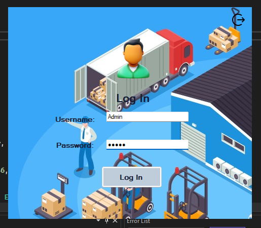
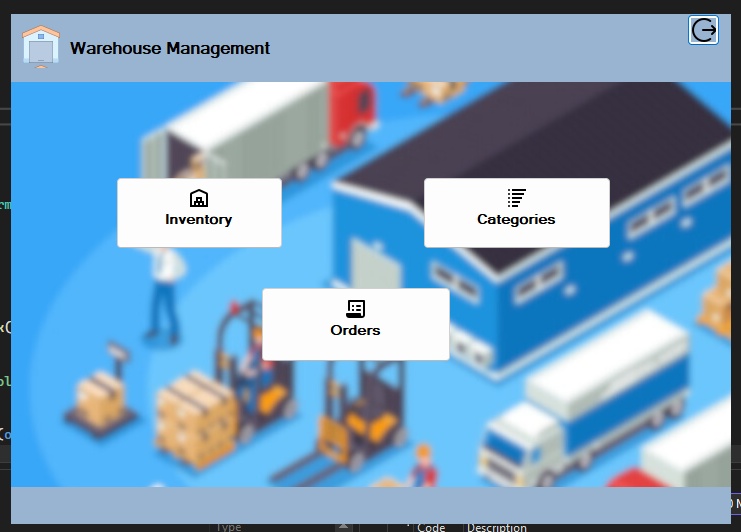
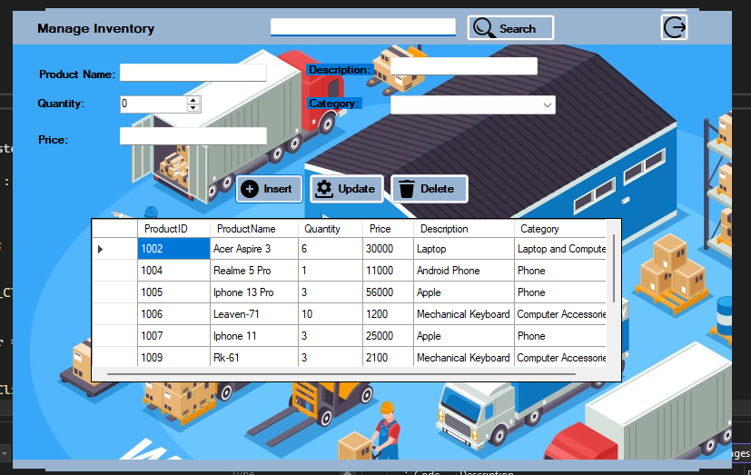
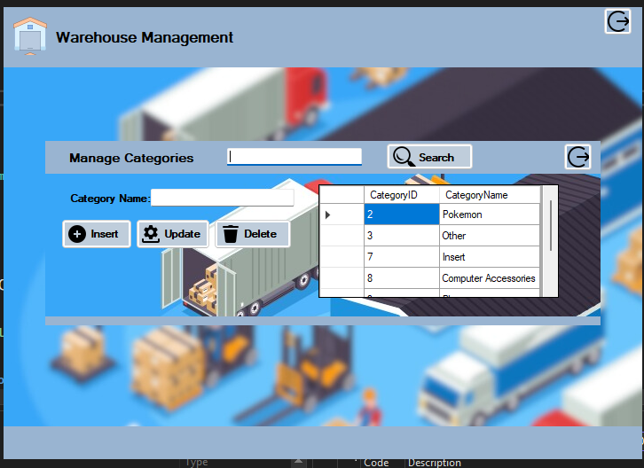
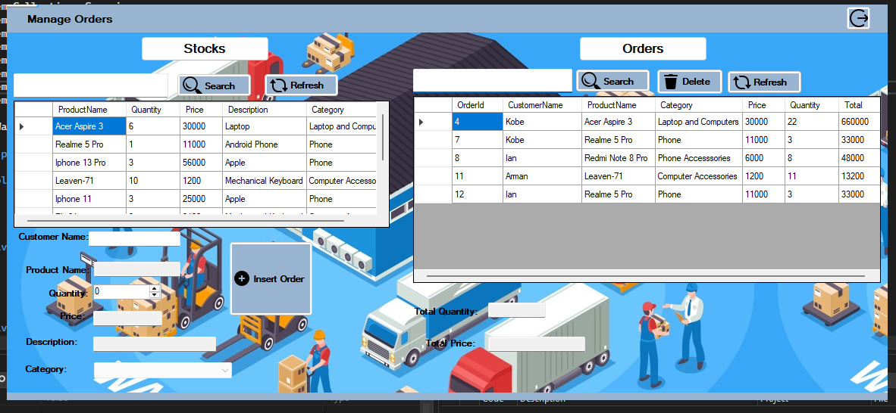

# 📦 Warehouse Management System

A **C# Windows Forms Application (.NET Framework 4.7.2)** for managing warehouse operations, built as part of an **Event-Driven Programming** course.  
The system provides an intuitive desktop interface for managing products, categories, customers, and orders with full database integration.

---

## 🚀 Features
- **Product Management** – Add, edit, delete, and search products.
- **Category Management** – Organize products into categories.
- **Customer Management** – Store and manage customer details.
- **Order Management** – Create and track orders with automatic inventory updates.
- **Inventory Tracking** – Real-time inventory display using DataGridView.
- **User-Friendly Interface** – Custom icons, images, and clean UI design.
- **Database Integration** – Uses **SQL Server** with ADO.NET for data persistence.
- **Modular Forms** – Separate forms for each management function.

---

## 🛠️ Tech Stack
- **Language:** C#  
- **Framework:** .NET Framework 4.7.2  
- **UI Framework:** Windows Forms (WinForms)  
- **Database:** SQL Server (LocalDB or full instance)  
- **Database Access:** ADO.NET  
- **IDE:** Visual Studio 2022  

---

## 🔑 Default Login Credentials
Use the following credentials to log in as an admin:

- **Username:** `Admin`  
- **Password:** `admin`

> ⚠️ These are default credentials for demonstration purposes only.

---
## 📷 Screenshots

**Login Screen**  


**Login Screen**  


**Homepage**  


**Inventory Management**  


**Categories Page**  


**Orders Page**  


## ⚙️ Setup Instructions

### 1️⃣ Clone the repository
```bash
git clone https://github.com/your-username/warehouse-management-system.git
cd warehouse-management-system


